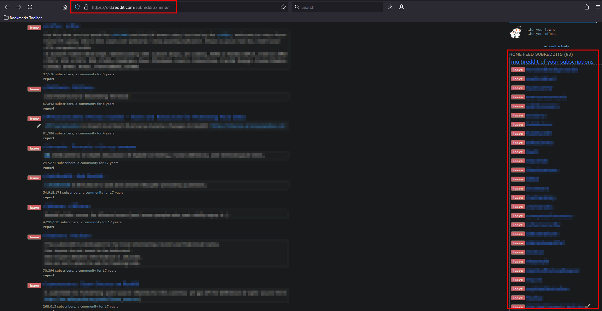
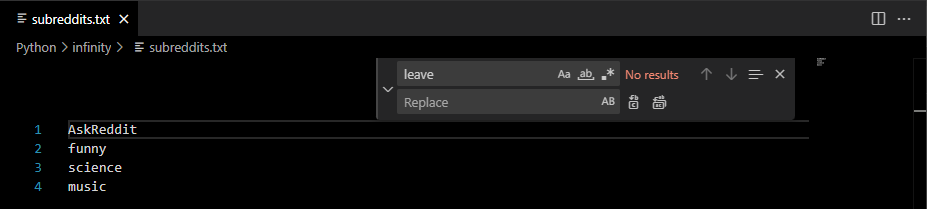
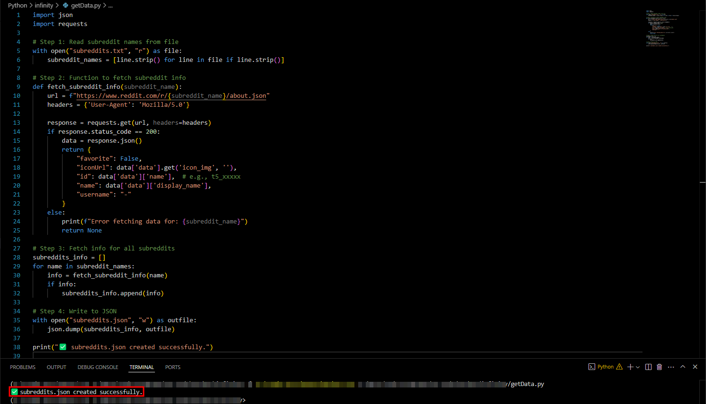
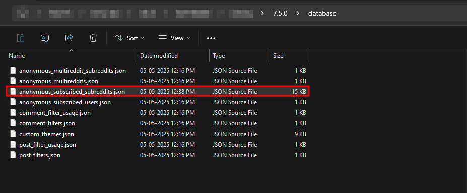
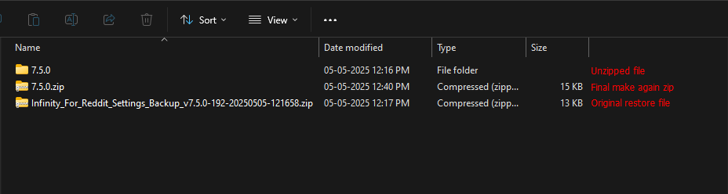

# 📥 Transfer Your Reddit Subscriptions to Infinity (Without Login)

This guide allows you to transfer your Reddit subscribed subreddits to the **Infinity for Reddit** app **without logging in**, using your exported subreddit list and a simple JSON replacement.

---

## ✅ Overview

We’ll export your subreddit list from Reddit’s website, convert it to JSON, and inject it into Infinity’s settings backup file.

No Reddit API keys, no OAuth — just basic file editing!

---

## 🚀 Steps

### 1️⃣ Export Your Subreddit List

1. Open [https://old.reddit.com/subreddits/mine/](https://old.reddit.com/subreddits/mine/) in your browser.

2. Select the list of your subscribed subreddits (as shown in the screenshot):

   

3. Paste this list into a new file called `subreddits.txt` in **VS Code** or any text editor.

4. Use **Find and Replace** to remove unwanted prefixes (like `leave`):

   

✅ You should now have a **clean list** of subreddit names, one per line.

---

### 2️⃣ Export Infinity Settings

1. On your mobile device, open the **Infinity** app.
2. Go to:
   `Hamburger Menu > Settings > Advanced > Backup Settings`
3. A backup ZIP will be created (default password: `123321`).
4. Copy the backup ZIP file to your PC.

---

### 3️⃣ Generate Subreddit JSON


1. Place `subreddits.txt` and `getData.py` in the same folder.
2. Run:

```bash
python getData.py
```

✅ This will generate `subreddits.json`.

3. Open `subreddits.json` and **copy everything inside**:

   

---

### 4️⃣ Modify Infinity Backup

1. Extract the backup ZIP file (password: `123321`):

   

2. Inside the extracted folder, open `anonymous_subscribed_subreddits.json`.

3. Replace its contents with the copied JSON from `subreddits.json`.

4. Save the file.

---

### 5️⃣ Repackage Backup

1. Zip the folder back again (same structure, no extra folder levels):

   

| File                                                                 | Description                   |
| -------------------------------------------------------------------- | ----------------------------- |
| `Infinity_For_Reddit_Settings_Backup_v7.5.0-192-20250505-121658.zip` | Original backup from Infinity |
| `7.5.0/`                                                             | Unzipped folder from backup   |
| `7.5.0.zip`                                                          | **Final zip** to import back  |

✅ Now restore this modified backup in the **Infinity app** → Settings → Restore Settings.

Enjoy your subscribed subreddits without logging in! 🎉

---

## 🙌 Notes & Feedback

This project is open source, created by [letsconfuse](https://github.com/letsconfuse).

If you have suggestions for improvement, run into issues, or want to share better ways to achieve this — feel free to open an issue or pull request.

Let’s make it better together and help others who need this solution!
