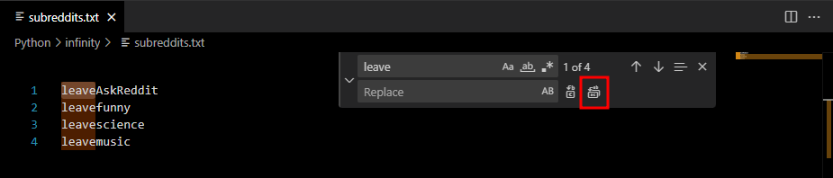

# Reddit to Infinity Subscription Transfer

A technical utility for migrating Reddit subreddit subscriptions to the Infinity for Reddit mobile application without requiring OAuth or API-based authentication. This tool leverages manual data extraction and Infinity's local backup system to achieve a seamless migration.

## Architecture Overview

The migration protocol follows a four-stage process:
1. **Extraction**: Harvesting raw subreddit strings from Reddit's legacy web interface.
2. **Standardization**: Normalizing extracted data into a line-delimited text format.
3. **Transformation**: Using a Python utility to fetch metadata (IDs, icons) from Reddit's Public API and generating a compatible JSON payload.
4. **Integration**: Injecting the generated JSON into an encrypted Infinity settings backup for local restoration.

## Prerequisites

- **Python Runtime**: 3.x installed.
- **Dependencies**: `requests` library.
  ```bash
  pip install requests
  ```
- **Infinity for Reddit**: Mobile application installed with an existing local backup.

## Execution Protocol

### 1. Data Acquisition
1. Navigate to [old.reddit.com/subreddits/mine/](https://old.reddit.com/subreddits/mine/).
2. Extract the list of subscribed subreddits.
   
3. Save the raw list as `subreddits.txt` in the project root.
4. Normalize the file by ensuring it contains one subreddit name per line (strip prefixes like "leave").
   
   

### 2. Environment Configuration
Ensure `getData.py` and `subreddits.txt` are in the same directory. The script requires network access to fetch subreddit metadata from Reddit's public endpoints.

### 3. Data Transformation
Execute the transformation script:
```bash
python getData.py
```
This generates `subreddits.json`, containing the standardized objects required by Infinity.


### 4. Integration with Infinity
1. Generate an Infinity settings backup on your mobile device (default password: `123321`).
2. Transfer the backup ZIP to your workstation and extract it.
   
3. Locate `anonymous_subscribed_subreddits.json` within the extracted structure.
4. Replace the entire contents of this file with the data from `subreddits.json`.
5. Re-compress the structure into a ZIP format, maintaining the original directory hierarchy.
   
6. Restore the modified backup in the Infinity app under **Advanced > Restore Settings**.

## Data Privacy and Security

- **Local Execution**: All data processing and file modification occur locally on your machine.
- **No Private API Access**: The protocol does not require Reddit login credentials or OAuth tokens.
- **Backup Integrity**: Always maintain an original copy of your Infinity backup before modification.

## Disclaimer

This project is an independent utility and is not affiliated with Reddit Inc. or the developers of Infinity for Reddit. Users are responsible for ensuring the backup modification process follows their device's security guidelines.
